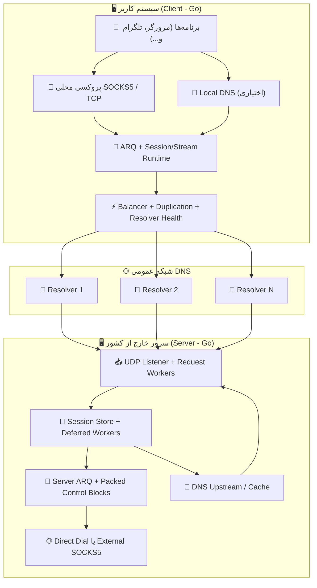
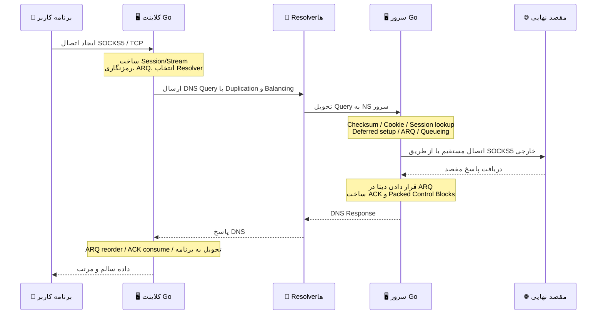

# پروژه MasterDnsVPN 🚀

## [نسخه فارسی](https://github.com/masterking32/MasterDnsVPN/blob/main/README_FA.MD) | [English Version](https://github.com/masterking32/MasterDnsVPN/blob/main/README.MD) | [Spanish Version](https://github.com/masterking32/MasterDnsVPN/blob/main/README_ES.MD)

پروژه **MasterDnsVPN** یک راهکار مقاوم، کم‌سربار و پیشرفته برای دور زدن فیلترینگ و سانسور اینترنت است که ترافیک TCP و پروتکل‌های مبتنی بر آن را در قالب query و responseهای DNS حمل می‌کند. نسخه فعلی پروژه به‌صورت کامل با **Go** پیاده‌سازی شده و مسیر اصلی و بهینه‌ی آن برای **SOCKS5 over DNS** طراحی شده است.

این سامانه به‌طور خاص برای شرایطی طراحی شده که روش‌های سنتی VPN یا تونل‌های شناخته‌شده، به‌دلیل اختلالات گسترده، loss بالا، محدودیت MTU، یا مسدودسازی resolverها کیفیت کافی ندارند.

هدف اصلی **MasterDnsVPN** فراهم کردن تونلی امن، قابل‌اعتماد و انعطاف‌پذیر است که سربار پروتکل را به حداقل رسانده و روی لینک‌های ناپایدار هم پایداری قابل قبولی بدهد.

---

❌ رفع مسئولیت: این پروژه فقط جنبه آموزشی و تحقیقاتی دارد. استفاده از آن ممکن است با قوانین یا سیاست‌های شبکه در برخی کشورها یا محیط‌ها ناسازگار باشد و مسئولیت استفاده از آن بر عهده خود کاربر است.

---

# کانال اطلاع رسانی تغییرات برنامه 📢

### برای اطلاع از آخرین اخبار، آپدیت‌ها و تغییرات این پروژه، لطفاً کانال تلگرام ما را دنبال کنید: [Telegram Channel](https://t.me/masterdnsvpn)

---

شما به‌راحتی می‌توانید با زدن روی دکمه ⭐ به‌صورت رایگان از این پروژه حمایت کنید.

در صورتی که علاقه‌مند به حمایت مالی هستید، می‌توانید از طریق لینک‌های زیر اقدام کنید:

TON: `masterking32.ton`

EVM-compatible blockchains: `0x517f07305D6ED781A089322B6cD93d1461bF8652`

TRC20 chain: `TLApdY8APWkFHHoxebxGY8JhMeChiETqFH`

---

## ویژگی‌های کلیدی و مزایا ✨

- **دور زدن سانسور شدید:** 🛡️ طراحی اختصاصی برای افزایش احتمال عبور از فایروال‌ها و سیاست‌های محدودکنندهٔ شبکه که پروتکل‌های VPN معمولی را مسدود می‌کنند.
- **پیاده‌سازی کامل با Go:** ⚙️ کلاینت، سرور، ARQ، runtime صف‌ها، balancing، resolver health و session handling همگی در نسخه فعلی با Go پیاده‌سازی شده‌اند.
- **توزیع بار و تعدد رزولورها (Load Balancing):** ⚡ پشتیبانی از چندین DNS Resolver مختلف با استراتژی‌های انتخاب تصادفی، round-robin، کمترین loss و کمترین latency بر اساس داده‌ی واقعی runtime.
- **تکثیر پکت چند‌مسیره (Packet Duplication):** 📡 قابلیت ارسال همزمان هر پکت از طریق چندین resolver مختلف. این تکنیک مصرف پهنای باند را بالا می‌برد، اما روی شبکه‌های پر اختلال احتمال رسیدن پکت‌ها را به‌شدت بیشتر می‌کند.
- **پروتکل اختصاصی و ARQ سفارشی با سربار بسیار پایین:** 🔄 این پروژه به‌جای QUIC از پروتکل اختصاصی و لایه ARQ سفارشی خودش استفاده می‌کند. به همین دلیل سربار هر پکت تا حد ممکن پایین نگه داشته شده و در سبک‌ترین حالت می‌تواند تا **۷ بایت** برسد.
- **سیستم Resolver Health و بازفعال‌سازی خودکار:** 🧠 resolverهای ضعیف در زمان اجرا auto-disable می‌شوند، در پس‌زمینه دوباره با MTU synced تست می‌شوند و در صورت سالم شدن دوباره وارد pool فعال می‌شوند.
- **کشف و همگام‌سازی MTU:** 🧰 کلاینت resolverها را تست می‌کند، MTU آپلود و دانلود را می‌سنجد، resolverهای نامناسب را کنار می‌گذارد و روی synced MTU مشترک کار می‌کند.
- **بهینه‌سازی اختصاصی SOCKS5:** 🧦 مسیر اصلی runtime برای SOCKS5 طراحی شده و stream setup، ACK path و control flow آن از حالت عمومی سبک‌تر و پخته‌تر است.
- **Packed Control Blocks:** 📦 سرور می‌تواند ACKها و control packetهای کوچک را تجمیع و در قالب بلاک‌های فشرده‌تر برگرداند تا تعداد پاسخ‌ها و سربار کمتر شود.
- **Stream-aware Resolver Routing:** 🌐 هر stream می‌تواند resolver ترجیحی خودش را داشته باشد و در صورت resendهای متوالی، failover کنترل‌شده بزند.
- **فشرده‌سازی و تجمیع بسته‌های کوچک:** 🗜️ در صورت نیاز و تنظیم توسط کاربر، compression و batching باعث می‌شود تعداد requestها کمتر و ظرفیت مفید هر MTU بیشتر شود.
- **امنیت قوی و رمزنگاری انعطاف‌پذیر:** 🔐 پشتیبانی از روش‌های `XOR`، `ChaCha20`، `AES-128-GCM`، `AES-192-GCM` و `AES-256-GCM`.
- **قابلیت DNS محلی روی کلاینت:** 📛 در صورت نیاز، کلاینت می‌تواند DNS محلی ارائه دهد و queryهای لوکال را از داخل تونل عبور دهد.

---

# راه‌اندازی 🧑‍💻

## بخش ۱: پیش‌نیازهای شبکه (پیکربندی DNS) 🛠️

برای اینکه سرور شما بتواند درخواست‌های DNS را به‌طور مستقیم دریافت و پردازش کند، باید مدیریت (Delegation) یک زیردامنه را به سرور اختصاصی خودتان بسپارید. برای این کار، وارد پنل مدیریت DNS دامنهٔ خود شوید و دقیقاً مطابق مراحل زیر دو رکورد ایجاد کنید:

### گام ۱.۱: ساخت رکورد A (معرفی IP سرور) 🅰️

- **نوع رکورد (Type):** `A`
- **نام (Name):** یک نام کوتاه دلخواه مثل `ns`
- **آدرس (IPv4 address):** آی‌پی سرور شما

> **نتیجه:** `ns.example.com -> 1.2.3.4`

### گام ۱.۲: ساخت رکورد NS (ارجاع زیردامنهٔ تونل) 🏷️

- **نوع رکورد (Type):** `NS`
- **نام (Name):** زیردامنهٔ اصلی تونل مثل `v`
- **سرور نام (Target/Nameserver):** همان رکورد A مرحله قبل

> **نتیجه:** `v.example.com -> ns.example.com`

---

## بخش ۱.۳: اخطار بسیار مهم (مخصوص کاربران Cloudflare) ⚠️

اگر از Cloudflare استفاده می‌کنید، **باید** وضعیت proxy برای رکورد `A` روی حالت **DNS only** باشد. اگر proxy روشن باشد، UDP پورت `53` عبور نمی‌کند و تونل شما کار نخواهد کرد.

## بخش ۱.۴: نکتهٔ طلایی برای افزایش سرعت (MTU) 💡

در پروتکل DNS، طول دامنه بخشی از فضای مفید هر request را می‌گیرد. هرچه نام دامنه و labelها کوتاه‌تر باشند، فضای بیشتری برای payload باقی می‌ماند و throughput بهتر می‌شود.

---

## بخش ۲: نصب و راه‌اندازی (کلاینت و سرور) 🚀

شما می‌توانید این پروژه را به دو روش نصب و اجرا کنید:

1. استفاده از فایل‌های کامپایل‌شدهٔ آماده
2. اجرای مستقیم از روی سورس با **Go**

### گام ۲.۱: استفاده از نسخه‌های کامپایل‌شده (روش پیشنهادی ✅)

برای راحتی شما، فایل‌های اجرایی کلاینت و سرور از قبل در releaseها منتشر می‌شوند. کافی است نسخه مناسب سیستم‌عامل خود را دانلود و از حالت فشرده خارج کنید.

> 💡 **نکته:** بسته‌های release معمولاً شامل فایل اجرایی و فایل‌های نمونه‌ی کانفیگ هستند.

#### لینک‌های دانلود کلاینت (Client) 📥

| سیستم‌عامل (OS) | پردازنده (Architecture) | مناسب برای سیستم‌های... | لینک دانلود مستقیم |
| :--- | :--- | :--- | :--- |
| ویندوز (Windows) 🪟 | `AMD64` (64-bit) | ویندوز ۱۰ و ۱۱ | [دانلود نسخه ویندوز ⬇️](https://github.com/masterking32/MasterDnsVPN/releases/latest/download/MasterDnsVPN_Client_Windows_AMD64.zip) |
| مک‌اواس (macOS) 🍎 | `ARM64` | مک‌های جدید (سری M1 / M2 / M3) | [دانلود نسخه مک (Apple Silicon) ⬇️](https://github.com/masterking32/MasterDnsVPN/releases/latest/download/MasterDnsVPN_Client_MacOS_ARM64.zip) |
| لینوکس (Linux) 🐧 | `AMD64` (64-bit) | توزیع‌های جدید (اوبونتو ۲۲.۰۴+، دبیان ۱۲+) | [دانلود نسخه لینوکس (جدید) ⬇️](https://github.com/masterking32/MasterDnsVPN/releases/latest/download/MasterDnsVPN_Client_Linux_AMD64.zip) |
| لینوکس (Legacy) 🐧 | `AMD64` (64-bit) | توزیع‌های قدیمی (اوبونتو ۲۰.۰۴، دبیان ۱۱) | [دانلود نسخه لینوکس (سازگاری بالا) ⬇️](https://github.com/masterking32/MasterDnsVPN/releases/latest/download/MasterDnsVPN_Client_Linux-Legacy_AMD64.zip) |
| لینوکس (ARM) 🐧 | `ARM64` | سرورهای ARM، رزبری‌پای و بردهای مشابه | [دانلود نسخه لینوکس (ARM) ⬇️](https://github.com/masterking32/MasterDnsVPN/releases/latest/download/MasterDnsVPN_Client_Linux_ARM64.zip) |

#### لینک‌های دانلود سرور (Server) 📤

| سیستم‌عامل (OS) | پردازنده (Architecture) | مناسب برای سیستم‌های... | لینک دانلود مستقیم |
| :--- | :--- | :--- | :--- |
| ویندوز (Windows) 🪟 | `AMD64` (64-bit) | ویندوز سرور، ویندوز ۱۰ و ۱۱ | [دانلود سرور ویندوز ⬇️](https://github.com/masterking32/MasterDnsVPN/releases/latest/download/MasterDnsVPN_Server_Windows_AMD64.zip) |
| لینوکس (Linux) 🐧 | `AMD64` (64-bit) | سرورهای اوبونتو ۲۲.۰۴+، دبیان ۱۲+ | [دانلود سرور لینوکس (جدید) ⬇️](https://github.com/masterking32/MasterDnsVPN/releases/latest/download/MasterDnsVPN_Server_Linux_AMD64.zip) |
| لینوکس (Legacy) 🐧 | `AMD64` (64-bit) | سرورهای قدیمی (اوبونتو ۲۰.۰۴، دبیان ۱۱) | [دانلود سرور لینوکس (سازگاری بالا) ⬇️](https://github.com/masterking32/MasterDnsVPN/releases/latest/download/MasterDnsVPN_Server_Linux-Legacy_AMD64.zip) |
| لینوکس (ARM) 🐧 | `ARM64` | سرورهای ARM | [دانلود سرور لینوکس (ARM) ⬇️](https://github.com/masterking32/MasterDnsVPN/releases/latest/download/MasterDnsVPN_Server_Linux_ARM64.zip) |
| مک‌اواس (macOS) 🍎 | `ARM64` | مک‌های جدید (سری M1 / M2 / M3) | [دانلود سرور مک (Apple Silicon) ⬇️](https://github.com/masterking32/MasterDnsVPN/releases/latest/download/MasterDnsVPN_Server_MacOS_ARM64.zip) |

---

### گام ۲.۲: آماده‌سازی و اجرا در لینوکس 🗂️

در لینوکس، پس از دانلود فایل ZIP:

```bash
sudo apt update
sudo apt install unzip nano
```

سپس فایل را استخراج کنید:

```bash
unzip MasterDnsVPN_Client_Linux_AMD64.zip
ls
```

در صورت نیاز مجوز اجرا بدهید:

```bash
chmod +x MasterDnsVPN_Client_Linux_AMD64
chmod +x MasterDnsVPN_Server_Linux_AMD64
```

فایل تنظیمات را ویرایش کنید:

```bash
nano client_config.toml
nano server_config.toml
```

و بعد اجرا:

```bash
./MasterDnsVPN_Client_Linux_AMD64
./MasterDnsVPN_Server_Linux_AMD64
```

---

### گام ۲.۳: نصب و اجرا از طریق سورس‌کد (نسخه فعلی Go) 🧑‍💻

> ⚠️ **توجه:** این بخش برای توسعه‌دهندگان یا کسانی است که می‌خواهند برنامه را مستقیماً از سورس Go اجرا کنند.

#### پیش‌نیاز

- Go `1.24` یا جدیدتر

#### ساخت از روی سورس

```bash
git clone https://github.com/masterking32/MasterDnsVPN.git
cd MasterDnsVPN

go build -o masterdnsvpn-client ./cmd/client
go build -o masterdnsvpn-server ./cmd/server
```

در ویندوز:

```powershell
git clone https://github.com/masterking32/MasterDnsVPN.git
cd MasterDnsVPN

go build -o masterdnsvpn-client.exe .\cmd\client
go build -o masterdnsvpn-server.exe .\cmd\server
```

#### ساخت فایل‌های کانفیگ

در لینوکس و macOS:

```bash
cp client_config.toml.simple client_config.toml
cp server_config.toml.simple server_config.toml
cp client_resolvers.simple client_resolvers.txt
```

در ویندوز:

```powershell
Copy-Item client_config.toml.simple client_config.toml
Copy-Item server_config.toml.simple server_config.toml
Copy-Item client_resolvers.simple client_resolvers.txt
```

#### اجرای سرور و کلاینت

```bash
./masterdnsvpn-server -config server_config.toml
./masterdnsvpn-client -config client_config.toml
```

در ویندوز:

```powershell
.\masterdnsvpn-server.exe -config server_config.toml
.\masterdnsvpn-client.exe -config client_config.toml
```

#### پارامترهای خط فرمان

هر دو باینری از این پارامترها پشتیبانی می‌کنند:

| پارامتر | توضیح |
| :--- | :--- |
| `-config` | مسیر فایل تنظیمات |
| `-log` | مسیر فایل لاگ اختیاری |
| `-version` | نمایش نسخه و خروج |

نمونه:

```bash
./masterdnsvpn-server -config server_config.toml -log server.log
./masterdnsvpn-client -config client_config.toml -log client.log
```

---

# بخش ۳: ساختار فایل‌های تنظیمات (Config) 🛠️

## بخش ۳.۱: فایل‌های مهم پروژه 📂

| فایل | کاربرد |
| :--- | :--- |
| `client_config.toml` | تنظیمات اصلی کلاینت |
| `server_config.toml` | تنظیمات اصلی سرور |
| `client_resolvers.txt` | لیست resolverها |
| `encrypt_key.txt` | کلید مشترک سمت سرور |
| `client_config.toml.simple` | نمونه کانفیگ کامل کلاینت برای نسخه Go |
| `server_config.toml.simple` | نمونه کانفیگ کامل سرور برای نسخه Go |

فرمت قابل قبول در `client_resolvers.txt`:

- `IP`
- `IP:PORT`
- `CIDR`
- `CIDR:PORT`

نمونه:

```text
8.8.8.8
1.1.1.1:53
9.9.9.0/24
208.67.222.0/24:5353
```

---

## بخش ۳.۲: پیکربندی سریع کلاینت 🚀

اگر سرور را بالا آورده‌اید، این چند مورد روی کلاینت الزامی است:

1. **`ENCRYPTION_KEY`** باید با محتوای `encrypt_key.txt` سرور یکی باشد.
2. **`DOMAINS`** باید با `DOMAIN` سرور یکی باشد.
3. **`client_resolvers.txt`** باید شامل resolverهای معتبر باشد.
4. برای استفاده معمول، **`PROTOCOL_TYPE = "SOCKS5"`** بگذارید.

---

## بخش ۳.۳: پیکربندی سریع سرور ⚙️

برای سرور، این بخش‌ها حیاتی‌اند:

1. **`DOMAIN`** را دقیقاً با دامنه‌ی delegated شده تنظیم کنید.
2. **`DATA_ENCRYPTION_METHOD`** باید با کلاینت یکسان باشد.
3. **`ENCRYPTION_KEY_FILE`** مسیر فایل کلید را مشخص می‌کند.
4. اگر می‌خواهید مستقیم به مقصد وصل شوید، **`USE_EXTERNAL_SOCKS5 = false`** بگذارید.
5. اگر می‌خواهید از SOCKS5 خارجی عبور کنید، `USE_EXTERNAL_SOCKS5 = true` و `FORWARD_IP` / `FORWARD_PORT` را پر کنید.

---

## بخش ۳.۴: جدول متغیرهای پیکربندی کلاینت (`client_config.toml`) 📖

### هویت تونل و امنیت

| پارامتر | مقدار نمونه | مقادیر مجاز | توضیح |
| :--- | :--- | :--- | :--- |
| `DOMAINS` | `["v.domain.com"]` | لیست رشته | دامنه‌هایی که کلاینت برای ساخت query استفاده می‌کند. باید با دامنه سرور یکی باشد. |
| `DATA_ENCRYPTION_METHOD` | `1` | `0` تا `5` | `0=None`، `1=XOR`، `2=ChaCha20`، `3=AES-128-GCM`، `4=AES-192-GCM`، `5=AES-256-GCM` |
| `ENCRYPTION_KEY` | `""` | رشته | کلید مشترک بین کلاینت و سرور |

### پروکسی محلی

| پارامتر | مقدار نمونه | مقادیر مجاز | توضیح |
| :--- | :--- | :--- | :--- |
| `PROTOCOL_TYPE` | `"SOCKS5"` | `"SOCKS5"`, `"TCP"` | حالت اصلی و توصیه‌شده `SOCKS5` است. |
| `LISTEN_IP` | `"127.0.0.1"` | IP معتبر | آدرس bind پراکسی محلی |
| `LISTEN_PORT` | `18000` | پورت معتبر | پورت پراکسی محلی |
| `SOCKS5_AUTH` | `false` | `true/false` | احراز هویت پراکسی محلی |
| `SOCKS5_USER` | `"master_dns_vpn"` | رشته | نام کاربری پراکسی |
| `SOCKS5_PASS` | `"master_dns_vpn"` | رشته | رمز عبور پراکسی |

### Local DNS

| پارامتر | مقدار نمونه | مقادیر مجاز | توضیح |
| :--- | :--- | :--- | :--- |
| `LOCAL_DNS_ENABLED` | `false` | `true/false` | فعال‌سازی DNS محلی روی کلاینت |
| `LOCAL_DNS_IP` | `"127.0.0.1"` | IP معتبر | آدرس bind DNS محلی |
| `LOCAL_DNS_PORT` | `53` | پورت معتبر | پورت DNS محلی |
| `LOCAL_DNS_CACHE_MAX_RECORDS` | `10000` | عدد صحیح مثبت | سقف رکوردهای cache محلی |
| `LOCAL_DNS_CACHE_TTL_SECONDS` | `14400.0` | عدد مثبت | TTL cache محلی |
| `LOCAL_DNS_PENDING_TIMEOUT_SECONDS` | `300.0` | عدد مثبت | timeout pendingهای DNS محلی |
| `DNS_RESPONSE_FRAGMENT_TIMEOUT_SECONDS` | `60.0` | عدد مثبت | timeout مونتاژ fragmentهای پاسخ DNS |
| `LOCAL_DNS_CACHE_PERSIST_TO_FILE` | `true` | `true/false` | ذخیره cache روی فایل |
| `LOCAL_DNS_CACHE_FLUSH_INTERVAL_SECONDS` | `60.0` | عدد مثبت | فاصله flush کردن cache روی فایل |

### انتخاب Resolver، Duplication و Health

| پارامتر | مقدار نمونه | مقادیر مجاز | توضیح |
| :--- | :--- | :--- | :--- |
| `RESOLVER_BALANCING_STRATEGY` | `0` | `0` تا `4` | `0/2=Round Robin`، `1=Random`، `3=Least Loss`، `4=Lowest Latency` |
| `PACKET_DUPLICATION_COUNT` | `2` | `1` تا `8` | تعداد تکثیر packetهای عادی |
| `SETUP_PACKET_DUPLICATION_COUNT` | `2` | `1` تا `8` | تعداد تکثیر packetهای setup |
| `STREAM_RESOLVER_FAILOVER_RESEND_THRESHOLD` | `2` | عدد صحیح مثبت | آستانه failover resolver ترجیحی stream |
| `STREAM_RESOLVER_FAILOVER_COOLDOWN` | `1.0` | عدد مثبت | حداقل فاصله بین دو failover |
| `RECHECK_INACTIVE_SERVERS_ENABLED` | `true` | `true/false` | recheck پس‌زمینه resolverهای غیرفعال |
| `RECHECK_INACTIVE_INTERVAL_SECONDS` | `60.0` | عدد مثبت | فاصله سیکل recheck کلی |
| `RECHECK_SERVER_INTERVAL_SECONDS` | `3.0` | عدد مثبت | فاصله recheck هر entry |
| `RECHECK_BATCH_SIZE` | `5` | عدد صحیح مثبت | تعداد resolverهایی که در هر batch بررسی می‌شوند |
| `AUTO_DISABLE_TIMEOUT_SERVERS` | `true` | `true/false` | حذف runtime resolverهای timeout-only |
| `AUTO_DISABLE_TIMEOUT_WINDOW_SECONDS` | `60.0` | عدد مثبت | بازه‌ای که اگر فقط timeout دیده شود resolver حذف می‌شود |
| `AUTO_DISABLE_MIN_OBSERVATIONS` | `6` | عدد صحیح مثبت | حداقل تعداد observation برای auto-disable |
| `AUTO_DISABLE_CHECK_INTERVAL_SECONDS` | `3.0` | عدد مثبت | فاصله بررسی auto-disable |
| `BASE_ENCODE_DATA` | `false` | `true/false` | base-safe کردن payload پیش از حمل در DNS |

### فشرده‌سازی

| پارامتر | مقدار نمونه | مقادیر مجاز | توضیح |
| :--- | :--- | :--- | :--- |
| `UPLOAD_COMPRESSION_TYPE` | `0` | `0` تا `3` | `0=OFF`، `1=ZSTD`، `2=LZ4`، `3=ZLIB` |
| `DOWNLOAD_COMPRESSION_TYPE` | `0` | `0` تا `3` | نوع فشرده‌سازی دانلود |
| `COMPRESSION_MIN_SIZE` | `120` | عدد صحیح مثبت | حداقل اندازه payload برای compression |

### MTU و تست اولیه

| پارامتر | مقدار نمونه | مقادیر مجاز | توضیح |
| :--- | :--- | :--- | :--- |
| `MIN_UPLOAD_MTU` | `40` | عدد صحیح مثبت | حداقل MTU قابل قبول آپلود |
| `MIN_DOWNLOAD_MTU` | `100` | عدد صحیح مثبت | حداقل MTU قابل قبول دانلود |
| `MAX_UPLOAD_MTU` | `150` | عدد صحیح مثبت | سقف جستجوی MTU آپلود |
| `MAX_DOWNLOAD_MTU` | `500` | عدد صحیح مثبت | سقف جستجوی MTU دانلود |
| `MTU_TEST_RETRIES` | `2` | عدد صحیح مثبت | تعداد retry هر probe |
| `MTU_TEST_TIMEOUT` | `2.0` | عدد مثبت | timeout هر probe |
| `MTU_TEST_PARALLELISM` | `24` | عدد صحیح مثبت | میزان parallelism تست MTU |
| `SAVE_MTU_SERVERS_TO_FILE` | `false` | `true/false` | ذخیره نتیجه‌ی resolverهای موفق روی فایل |
| `MTU_SERVERS_FILE_NAME` | `"masterdnsvpn_success_test_{time}.log"` | رشته | نام فایل خروجی تست |
| `MTU_SERVERS_FILE_FORMAT` | `"{IP} - UP: {UP_MTU} DOWN: {DOWN-MTU}"` | رشته | فرمت ثبت resolverهای موفق |
| `MTU_USING_SECTION_SEPARATOR_TEXT` | `""` | رشته | جداکننده اختیاری در فایل خروجی |
| `MTU_REMOVED_SERVER_LOG_FORMAT` | `"Resolver {IP} removed at {TIME} due to {CAUSE}"` | رشته | فرمت ثبت حذف resolver |
| `MTU_ADDED_SERVER_LOG_FORMAT` | `"Resolver {IP} added back at {TIME} (UP {UP_MTU}, DOWN {DOWN_MTU})"` | رشته | فرمت ثبت بازگشت resolver |

### Workerها، Queueها و Timerهای runtime

| پارامتر | مقدار نمونه | مقادیر مجاز | توضیح |
| :--- | :--- | :--- | :--- |
| `TUNNEL_READER_WORKERS` | `8` | عدد صحیح مثبت | تعداد workerهای خواندن |
| `TUNNEL_WRITER_WORKERS` | `8` | عدد صحیح مثبت | تعداد workerهای نوشتن |
| `TUNNEL_PROCESS_WORKERS` | `6` | عدد صحیح مثبت | تعداد workerهای پردازش |
| `TUNNEL_PACKET_TIMEOUT_SECONDS` | `10.0` | عدد مثبت | timeout کلی packet در runtime |
| `DISPATCHER_IDLE_POLL_INTERVAL_SECONDS` | `0.020` | عدد مثبت | فاصله polling dispatcher در زمان بیکاری |
| `TX_CHANNEL_SIZE` | `8192` | عدد صحیح مثبت | ظرفیت کانال TX |
| `RX_CHANNEL_SIZE` | `8192` | عدد صحیح مثبت | ظرفیت کانال RX |
| `RESOLVER_UDP_CONNECTION_POOL_SIZE` | `128` | عدد صحیح مثبت | اندازه pool UDP per resolver |
| `STREAM_QUEUE_INITIAL_CAPACITY` | `256` | عدد صحیح مثبت | ظرفیت اولیه queue stream |
| `ORPHAN_QUEUE_INITIAL_CAPACITY` | `64` | عدد صحیح مثبت | ظرفیت queue orphan |
| `DNS_RESPONSE_FRAGMENT_STORE_CAPACITY` | `512` | عدد صحیح مثبت | ظرفیت fragment store پاسخ DNS |
| `SOCKS_UDP_ASSOCIATE_READ_TIMEOUT_SECONDS` | `30.0` | عدد مثبت | timeout خواندن UDP ASSOCIATE |
| `CLIENT_TERMINAL_STREAM_RETENTION_SECONDS` | `45.0` | عدد مثبت | زمان نگهداری stream terminal |
| `CLIENT_CANCELLED_SETUP_RETENTION_SECONDS` | `120.0` | عدد مثبت | زمان نگهداری stream setup لغوشده |
| `SESSION_INIT_RETRY_BASE_SECONDS` | `1.0` | عدد مثبت | پایه retry برای session init |
| `SESSION_INIT_RETRY_STEP_SECONDS` | `1.0` | عدد مثبت | گام افزایش retry |
| `SESSION_INIT_RETRY_LINEAR_AFTER` | `5` | عدد صحیح مثبت | از این تعداد به بعد backoff خطی می‌شود |
| `SESSION_INIT_RETRY_MAX_SECONDS` | `60.0` | عدد مثبت | سقف delay retry |
| `SESSION_INIT_BUSY_RETRY_INTERVAL_SECONDS` | `60.0` | عدد مثبت | retry delay برای حالت SESSION_BUSY |

### Ping / Keepalive

| پارامتر | مقدار نمونه | توضیح |
| :--- | :--- | :--- |
| `PING_AGGRESSIVE_INTERVAL_SECONDS` | `0.300` | فاصله پینگ در حالت داغ |
| `PING_LAZY_INTERVAL_SECONDS` | `1.0` | فاصله پینگ در حالت عادی |
| `PING_COOLDOWN_INTERVAL_SECONDS` | `3.0` | فاصله پینگ در حالت cooldown |
| `PING_COLD_INTERVAL_SECONDS` | `30.0` | فاصله پینگ در حالت cold |
| `PING_WARM_THRESHOLD_SECONDS` | `5.0` | آستانه ورود از warm |
| `PING_COOL_THRESHOLD_SECONDS` | `10.0` | آستانه ورود به cool |
| `PING_COLD_THRESHOLD_SECONDS` | `20.0` | آستانه ورود به cold |

### ARQ و Packing

| پارامتر | مقدار نمونه | توضیح |
| :--- | :--- | :--- |
| `MAX_PACKETS_PER_BATCH` | `5` | سقف packed control block در هر batch |
| `ARQ_WINDOW_SIZE` | `600` | اندازه پنجره ARQ |
| `ARQ_INITIAL_RTO_SECONDS` | `0.5` | RTO اولیه data |
| `ARQ_MAX_RTO_SECONDS` | `6.0` | سقف RTO data |
| `ARQ_CONTROL_INITIAL_RTO_SECONDS` | `0.5` | RTO اولیه control |
| `ARQ_CONTROL_MAX_RTO_SECONDS` | `6.0` | سقف RTO control |
| `ARQ_MAX_CONTROL_RETRIES` | `120` | سقف retry control |
| `ARQ_INACTIVITY_TIMEOUT_SECONDS` | `1800.0` | timeout inactivity |
| `ARQ_DATA_PACKET_TTL_SECONDS` | `2400.0` | TTL packetهای data |
| `ARQ_CONTROL_PACKET_TTL_SECONDS` | `1200.0` | TTL packetهای control |
| `ARQ_MAX_DATA_RETRIES` | `1200` | سقف retry data |
| `ARQ_TERMINAL_DRAIN_TIMEOUT_SECONDS` | `120.0` | timeout drain terminal |
| `ARQ_TERMINAL_ACK_WAIT_TIMEOUT_SECONDS` | `90.0` | timeout انتظار ACK terminal |

### لاگ

| پارامتر | مقدار نمونه | مقادیر مجاز | توضیح |
| :--- | :--- | :--- | :--- |
| `LOG_LEVEL` | `"INFO"` | `DEBUG`, `INFO`, `WARN`, `ERROR` | سطح لاگ کلاینت |

---

## بخش ۳.۵: جدول متغیرهای پیکربندی سرور (`server_config.toml`) 📖

### سیاست تونل

| پارامتر | مقدار نمونه | مقادیر مجاز | توضیح |
| :--- | :--- | :--- | :--- |
| `DOMAIN` | `["v.domain.com"]` | لیست رشته | دامنه‌های این تونل. باید با `DOMAINS` کلاینت هماهنگ باشد. |
| `SUPPORTED_UPLOAD_COMPRESSION_TYPES` | `[0,1,2,3]` | لیست از `0` تا `3` | compressionهای مجاز آپلود |
| `SUPPORTED_DOWNLOAD_COMPRESSION_TYPES` | `[0,1,2,3]` | لیست از `0` تا `3` | compressionهای مجاز دانلود |

### UDP Listener و ظرفیت ورودی

| پارامتر | مقدار نمونه | توضیح |
| :--- | :--- | :--- |
| `UDP_HOST` | `"0.0.0.0"` | آدرس bind سرور |
| `UDP_PORT` | `53` | پورت UDP سرور |
| `UDP_READERS` | `4` | تعداد goroutineهای خواندن UDP |
| `DNS_REQUEST_WORKERS` | `24` | تعداد workerهای پردازش درخواست DNS |
| `MAX_CONCURRENT_REQUESTS` | `32768` | ظرفیت queue درخواست‌های ورودی |
| `SOCKET_BUFFER_SIZE` | `8388608` | اندازه بافر socket |
| `MAX_PACKET_SIZE` | `65535` | اندازه بافر packet pool |
| `DROP_LOG_INTERVAL_SECONDS` | `2.0` | فاصله لاگ overload/drop |

### Deferred Session Runtime

| پارامتر | مقدار نمونه | توضیح |
| :--- | :--- | :--- |
| `DEFERRED_SESSION_WORKERS` | `12` | تعداد workerهای deferred session |
| `DEFERRED_SESSION_QUEUE_LIMIT` | `8192` | ظرفیت queue deferred |
| `SESSION_ORPHAN_QUEUE_INITIAL_CAPACITY` | `128` | ظرفیت اولیه orphan queue |
| `STREAM_QUEUE_INITIAL_CAPACITY` | `256` | ظرفیت اولیه queue stream |
| `DNS_FRAGMENT_STORE_CAPACITY` | `512` | ظرفیت DNS fragment store |
| `SOCKS5_FRAGMENT_STORE_CAPACITY` | `1024` | ظرفیت SOCKS5 fragment store |

### چرخه عمر Session و Stream

| پارامتر | مقدار نمونه | توضیح |
| :--- | :--- | :--- |
| `INVALID_COOKIE_WINDOW_SECONDS` | `2.0` | پنجره invalid-cookie tracker |
| `INVALID_COOKIE_ERROR_THRESHOLD` | `10` | آستانه خطای invalid cookie |
| `SESSION_TIMEOUT_SECONDS` | `300.0` | timeout inactivity session |
| `SESSION_CLEANUP_INTERVAL_SECONDS` | `30.0` | فاصله cleanup session |
| `CLOSED_SESSION_RETENTION_SECONDS` | `600.0` | زمان نگهداری session بسته |
| `SESSION_INIT_REUSE_TTL_SECONDS` | `600.0` | زمان reuse امضای init |
| `RECENTLY_CLOSED_STREAM_TTL_SECONDS` | `600.0` | زمان نگهداری stream بسته‌شده |
| `RECENTLY_CLOSED_STREAM_CAP` | `2000` | سقف رکوردهای stream بسته |
| `TERMINAL_STREAM_RETENTION_SECONDS` | `45.0` | زمان نگهداری stream terminal |

### DNS Tunnel Upstream

| پارامتر | مقدار نمونه | توضیح |
| :--- | :--- | :--- |
| `DNS_UPSTREAM_SERVERS` | `["1.1.1.1:53", "1.0.0.1:53"]` | لیست DNS upstream برای DNS-over-tunnel |
| `DNS_UPSTREAM_TIMEOUT` | `4.0` | timeout هر lookup upstream |
| `DNS_INFLIGHT_WAIT_TIMEOUT_SECONDS` | `8.0` | timeout followerهای inflight lookup |
| `DNS_FRAGMENT_ASSEMBLY_TIMEOUT` | `300.0` | timeout مونتاژ fragmentهای DNS |
| `DNS_CACHE_MAX_RECORDS` | `50000` | سقف cache DNS داخل تونل |
| `DNS_CACHE_TTL_SECONDS` | `300.0` | TTL cache DNS داخل تونل |

### Forwarding و SOCKS خارجی

| پارامتر | مقدار نمونه | توضیح |
| :--- | :--- | :--- |
| `SOCKS_CONNECT_TIMEOUT` | `8.0` | timeout اتصال outbound |
| `USE_EXTERNAL_SOCKS5` | `false` | اگر `true` باشد از SOCKS5 خارجی استفاده می‌شود |
| `SOCKS5_AUTH` | `false` | احراز هویت برای SOCKS5 خارجی |
| `SOCKS5_USER` | `"admin"` | نام کاربری SOCKS5 خارجی |
| `SOCKS5_PASS` | `"123456"` | رمز عبور SOCKS5 خارجی |
| `FORWARD_IP` | `""` | IP پراکسی خارجی |
| `FORWARD_PORT` | `0` | پورت پراکسی خارجی |

### امنیت

| پارامتر | مقدار نمونه | مقادیر مجاز | توضیح |
| :--- | :--- | :--- | :--- |
| `DATA_ENCRYPTION_METHOD` | `1` | `0` تا `5` | باید با کلاینت یکی باشد |
| `ENCRYPTION_KEY_FILE` | `"encrypt_key.txt"` | مسیر فایل | مسیر فایل کلید سرور |

### ARQ، Packing و TTLهای کنترلی

| پارامتر | مقدار نمونه | توضیح |
| :--- | :--- | :--- |
| `MAX_PACKETS_PER_BATCH` | `20` | سقف بسته‌های packed control |
| `PACKET_BLOCK_CONTROL_DUPLICATION` | `2` | تعداد تکرار blockهای کنترلی packed |
| `STREAM_SETUP_ACK_TTL_SECONDS` | `400.0` | TTL ACKهای setup |
| `STREAM_RESULT_PACKET_TTL_SECONDS` | `300.0` | TTL پکت‌های result |
| `STREAM_FAILURE_PACKET_TTL_SECONDS` | `120.0` | TTL پکت‌های failure |
| `ARQ_WINDOW_SIZE` | `600` | اندازه پنجره ARQ |
| `ARQ_INITIAL_RTO_SECONDS` | `0.5` | RTO اولیه data |
| `ARQ_MAX_RTO_SECONDS` | `6.0` | سقف RTO data |
| `ARQ_CONTROL_INITIAL_RTO_SECONDS` | `0.5` | RTO اولیه control |
| `ARQ_CONTROL_MAX_RTO_SECONDS` | `6.0` | سقف RTO control |
| `ARQ_MAX_CONTROL_RETRIES` | `120` | سقف retry control |
| `ARQ_INACTIVITY_TIMEOUT_SECONDS` | `1800.0` | timeout inactivity |
| `ARQ_DATA_PACKET_TTL_SECONDS` | `2400.0` | TTL packetهای data |
| `ARQ_CONTROL_PACKET_TTL_SECONDS` | `1200.0` | TTL packetهای control |
| `ARQ_MAX_DATA_RETRIES` | `1200` | سقف retry data |
| `ARQ_TERMINAL_DRAIN_TIMEOUT_SECONDS` | `120.0` | timeout drain terminal |
| `ARQ_TERMINAL_ACK_WAIT_TIMEOUT_SECONDS` | `90.0` | timeout انتظار ACK terminal |

### لاگ

| پارامتر | مقدار نمونه | مقادیر مجاز | توضیح |
| :--- | :--- | :--- | :--- |
| `LOG_LEVEL` | `"INFO"` | `DEBUG`, `INFO`, `WARN`, `ERROR` | سطح لاگ سرور |

---

## بخش ۳.۶: درک بهتر از MTU و تنظیمات طلایی برای اجرای سریع ⚡

نسخه فعلی Go همچنان به‌شدت به MTU مناسب وابسته است. اگر MTU را خیلی بالا بگیرید:

- resolverهای بیشتری fail می‌شوند
- startup طولانی‌تر می‌شود
- fragmentation و loss بیشتر می‌شود

اگر خیلی پایین بگیرید:

- سرعت کم می‌شود
- اما پایداری بیشتر می‌شود

### پیشنهاد عملی

1. با sample config شروع کنید.
2. اجازه دهید کلاینت resolverها را تست کند.
3. خروجی MTU و تعداد resolverهای معتبر را ببینید.
4. اگر کیفیت بد است، `MIN_UPLOAD_MTU` و `MIN_DOWNLOAD_MTU` را کمی پایین‌تر بیاورید.
5. اگر می‌خواهید startup سریع‌تر شود، بازه `MIN/MAX` را محدودتر کنید.

---

## بخش ۴: راهنمای استفاده در موبایل (اندروید و آیفون) 📱

از آنجایی که در حال حاضر اپلیکیشن مستقیم برای اندروید یا iOS ارائه نشده، می‌توانید از طریق یکی از این روش‌ها از تونل روی گوشی استفاده کنید:

### روش اول: اشتراک‌گذاری پراکسی از روی کامپیوتر 📶

1. `LISTEN_IP` را روی `0.0.0.0` بگذارید.
2. کلاینت را روی کامپیوتر اجرا کنید.
3. گوشی و کامپیوتر را به یک شبکه وصل کنید.
4. در گوشی یک پروکسی **SOCKS5** با IP کامپیوتر و پورت `LISTEN_PORT` تنظیم کنید.

### روش دوم: اجرای کلاینت روی سرور واسط 🏗️

1. سرور اصلی را روی مقصد نهایی اجرا کنید.
2. کلاینت را روی سرور واسط اجرا کنید.
3. `LISTEN_IP` را روی `0.0.0.0` بگذارید.
4. از گوشی به SOCKS5 همان سرور واسط وصل شوید.

### روش سوم: ترکیب با پنل‌های دیگر 🛠️

اگر روی یک سرور، پنل یا سرویس دیگری دارید، می‌توانید outbound آن را به SOCKS5 لوکال کلاینت MasterDnsVPN بدهید و از آن به‌عنوان مسیر خروجی استفاده کنید.

### ⚠️ نکات مهم امنیتی برای موبایل

- اگر `LISTEN_IP = "0.0.0.0"` است، برای SOCKS5 احراز هویت بگذارید.
- اگر دستگاه‌ها به هم وصل نمی‌شوند، firewall سیستم را بررسی کنید.

---

## بخش ۵: نکات اضطراری و رفع مشکلات 🚨

### بخش ۵.۱: تنظیمات در شرایط loss شدید شبکه ⚠️

اگر network شما بسیار ناپایدار است:

1. تعداد resolverها را بیشتر کنید.
2. `PACKET_DUPLICATION_COUNT` را بالا ببرید.
3. balancing را روی `3` یا `4` امتحان کنید.
4. MTU را پایین‌تر بیاورید.
5. health system را روشن نگه دارید.

در شرایط خیلی سخت، duplicationهای بین `3` تا `6` معمولاً معقول‌اند، البته به‌قیمت مصرف بیشتر پهنای باند و CPU.

### بخش ۵.۲: رفع مشکل اشغال بودن پورت ۵۳ (در سرور لینوکس) 🛑

در اکثر توزیع‌های لینوکس، پورت `53` توسط `systemd-resolved` اشغال است. اگر سرور بالا نیامد:

```bash
sudo nano /etc/systemd/resolved.conf
```

و این مقدار را بگذارید:

```text
DNSStubListener=no
```

سپس:

```bash
sudo systemctl restart systemd-resolved
```

> ⚠️ **اخطار مهم:** روی یک سرور نمی‌توانید همزمان چند پروژه‌ی تونل DNS را روی پورت `53` اجرا کنید.

---

## بخش ۶: معماری و نحوهٔ کار سیستم 🛠️

پروژه **MasterDnsVPN** با ترکیب Session Multiplexing، Resolver Balancing، Packet Duplication، لایه‌ی ARQ اختصاصی و Deferred Session Runtime روی بستر UDP/DNS محدودیت‌های تونل‌های معمول را دور می‌زند.

### بخش ۶.۱: نمای کلی معماری دیاگرام 🌐



### بخش ۶.۲: جریان و چرخهٔ حیات پکت‌ها 🔄



### بخش ۶.۳: مفاهیم کلیدی استفاده‌شده 🧠

| مفهوم (Concept) | توضیح کارکرد در سیستم |
| :--- | :--- |
| **Session** | یک اتصال کلی بین کلاینت و سرور. |
| **Stream** | هر اتصال منطقی مستقل که روی Session حمل می‌شود. |
| **Resolver Runtime** | انتخاب resolver، duplication، health tracking، auto-disable و recheck |
| **ARQ** | ترتیب‌دهی، ACK، retransmit، timeout و terminal handling |
| **Deferred Session Runtime** | کارهای ordering-sensitive مثل setup، DNS query handling و packetهای حساس |
| **Packed Control Blocks** | تجمیع چند ACK یا control packet کوچک در یک block |
| **Synced MTU** | MTU مشترک انتخاب‌شده بین resolverهای معتبر |

---

## بخش ۷: نکات فنی پیشرفته ⚙️

- ⚡ **اتصال مستقیم یا از طریق SOCKS5 خارجی:** اگر `USE_EXTERNAL_SOCKS5 = false` باشد، سرور مستقیم به مقصد وصل می‌شود. اگر `true` باشد، از SOCKS5 خارجی عبور می‌کند.
- 🔄 **پینگ و پولینگ تطبیقی:** کلاینت با پروفایل‌های ping و dispatcher polling خودش بار idle را پایین نگه می‌دارد.
- 🧠 **Resolver failover روی هر stream:** اگر یک stream روی resolver بد گیر کند، resolver ترجیحی‌اش می‌تواند جابه‌جا شود.
- 📦 **تکرار blockهای کنترلی:** سرور می‌تواند آخرین packed control block را چند turn تکرار کند تا روی لینک lossy احتمال رسیدن ACKهای حیاتی بیشتر شود.
- 🔒 **کلید سمت سرور:** اگر `encrypt_key.txt` وجود نداشته باشد، سرور هنگام startup آن را می‌سازد.

---

## 🤝 مشارکت (Contributing)

ما از تمام مشارکت‌ها استقبال می‌کنیم. لطفاً اگر ایده، باگ یا بهبود عملکردی دارید، از طریق Issue یا Pull Request آن را مطرح کنید.

[Issues](https://github.com/masterking32/MasterDnsVPN/issues)

[Pull Requests](https://github.com/masterking32/MasterDnsVPN/pulls)

---

## 📄 مجوز (License)

این پروژه تحت مجوز **MIT** منتشر شده است. برای جزئیات بیشتر به فایل `LICENSE` مراجعه کنید.

---

## 👨‍💻 توسعه‌دهنده (Developer)

توسعه‌داده‌شده با ❤️ توسط: [**MasterkinG32**](https://github.com/masterking32)
